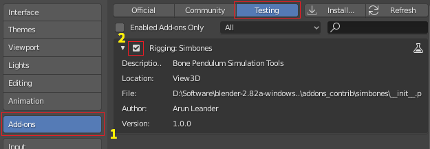
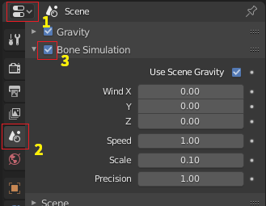
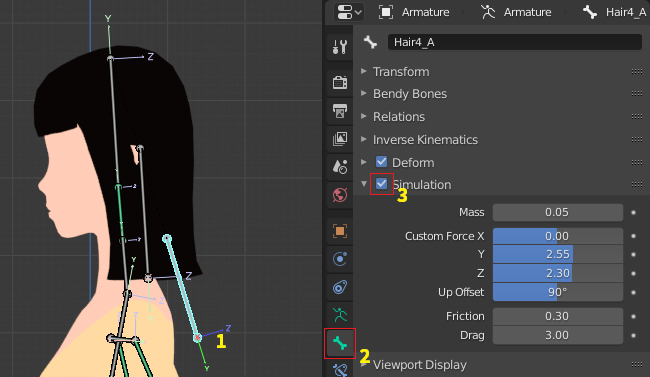
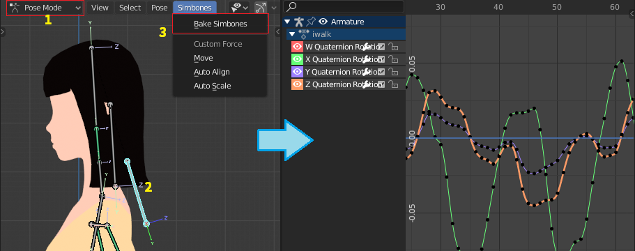
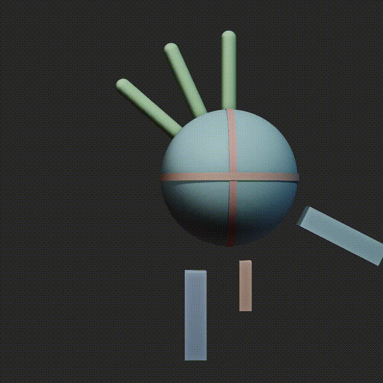

# Simbones
*Simbones* is a Blender Addon, which can simulate a pendulum-like motion of bones in an animated rig.

Simulating secondary movement with bones (instead of cloth, softbodies or others) is useful for exporting animations to game engines or other media which only supports skeletal deformations.

## Installation

Like any Blender Addon through the Blender Preferences.  
The addon is located in the Testing section.

### Dependencies

The addon requires the python `scipy` module. AFAIK, you have to install it manually for Blender's bundled python or tell Blender to use another python installation with `scipy` installed. Do the following steps to install `scipy` for a Blender installation's python.

1. Open the Blender Python Console.
2. Enter `import sys` to import the `sys` module.
3. Enter `sys.exec_prefix` to print the path to your python installation (e.g. `F:\blender-2.83.1-windows64\2.83\python`).
4. Open a console at `path/to/python/bin`.
5. Install `scipy` with `pip` by entering: `python -m pip install scipy`.
6. Restart Blender.

## Usage

1. Enable *Bone Simulation* in the scene settings. You can change the simulation time and space scale here.  

2. Select a pose bone and enable *Simulation* in the Pose Bone Properties.  

3. Go into pose mode and choose the menu item Simbones > Bake to bake the movement to keyframes.

## Operations

These shortcuts are available on selected pose bones in the 3D Viewport, when in Pose Mode. To understand the purpose of the *Custom Force* shortcuts, read the description of the *Custom Force* (under *Features*) first.

Name | Shortcut (default) |Description
--- | --- | ---
Bake Simbones               | Ctrl B        | Bake the movement of simbones to keyframes. Bakes all simbones in Object Mode and selected simbones in Pose Mode.
Move (Custom Force)         | F             | Interactively position the custom force in the 3D viewport.
Auto Align (Custom Force)   | Ctrl Shift F  | Align the custom force of simbones with their current orientation.
Auto Scale (Custom Force)   | Ctrl Shift G  | Scale the custom force of simbones to counteract gravity. As a result, the simbone will not move in their rest pose. This will only work with aligned simbones

## Features

Name | Description
--- | ---
Length | Different bone length will taken into account. Longer bones swing with a slower frequency.
Friction | Mechanical friction in world space. A high mechanical friction will result in less movement.
Drag | Air friction in world space. A high air friction will drag the end of the bones. This is especially useful if the bone moves through the scene, as in hair strands following the character.
Chaining | Chained simulated bones don't affect each other. However, they are calculated from parent to child in a hierarchial order. This makes using bone chaines possible.
Custom Force | Using the tools from the menu, a custom force can be setup quickly. The custom force can counteract gravity and let simulated bones maintain their initial orientation (rest pose) if there is no movement or parent orientation. This is a common problem with simulation, which usually cause hair or cloth to move and jiggle once the simulation commences and gravity starts to affect the elements. The custom force allows us to setup the bones and geometry in rest pose with gravity applied.

## Example Results

